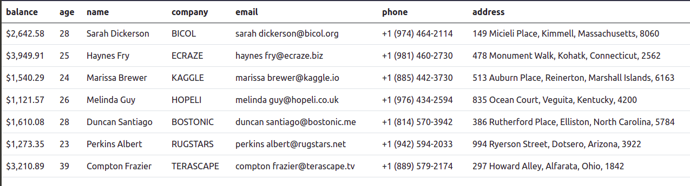

# Rendering-Data-Abstract-Factory

    Project made by following JsExpert bootcamp provided by ErickWendel
    This goal is to understando how to apply an abstract factory pattern

## Showcase

###### Same application running on the browser (npm run start:browser)

###### And now running on the console (npm run start:console)

